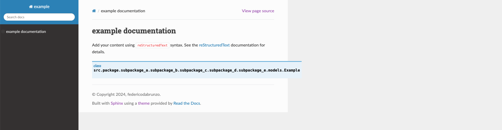

# render-issue-for-autodoc-generated-class-with-long-import-path
While I was trying to generate documentation with the [sphinx_rtd_theme](https://github.com/readthedocs/sphinx_rtd_theme) and using the `autodoc` extension I came into a render-issue for classes with a long import path.

The `<dt>` element containing the class import path overflows its `<dl>` parent and eventually the `wy-nav-content` `<div>`.

This example project contains the bare minimum to trigger the issue: there's an [autoclass directive](docs/index.rst?plain=1#L13) for a class placed under a long import path.

## :camera: Screenshot


## Steps to reproduce
Install the requirements:
```
pip install -r requirements.txt
```

Run the build:
```
sphinx-build --fresh-env docs docs/_build
```

Open `docs/_build/index.html` with a browser.
